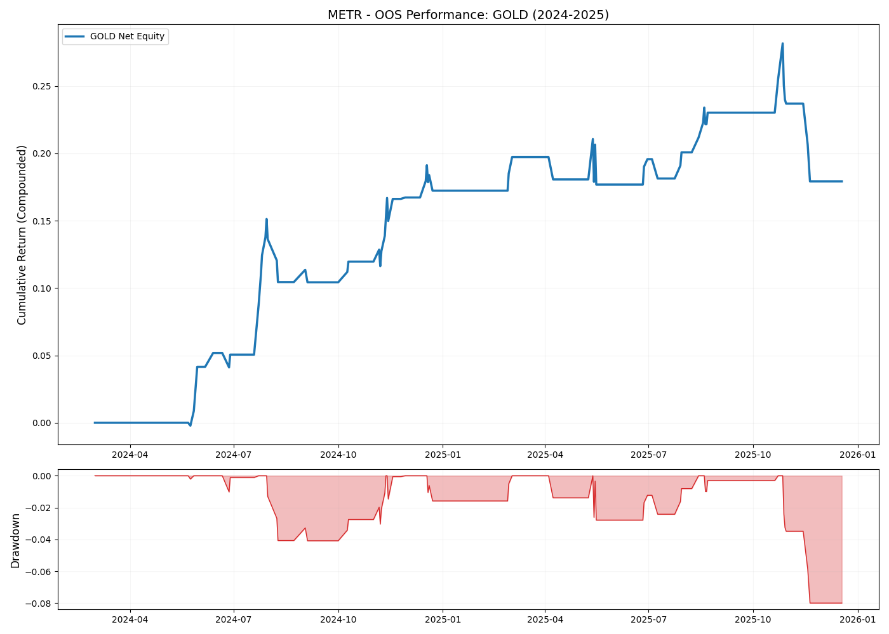
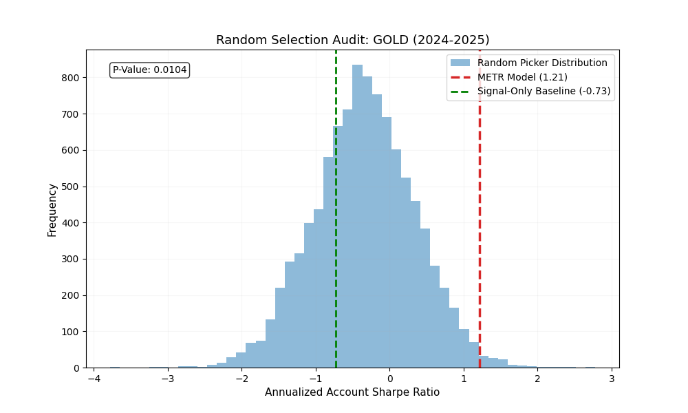

<div align="center">
  <h1>METR</h1>
  <p><strong>Market Exposure Timing Research</strong></p>

  <p>
    
    
    
    
  </p>

  <h4>A professional-grade meta-filtering framework for isolating statistical edge in financial markets.</h4>
</div>

---

## 🎯 The Core Thesis
> **"Can a machine learning model beat random market entries without live sentiment or macro data?"**

METR is a controlled empirical study testing whether uncorrelated asset classes possess predictable short-term inefficiencies. We validate edge not against a passive benchmark, but against **10,000 Monte Carlo simulations** of random trade selection — isolating true statistical skill from market noise.

---

## 🚀 Key Features

- **🛡️ Two-Layer Meta-Filter:** Momentum conviction base signals refined by a high-capacity XGBoost classifier.
- **🏷️ Triple Barrier Method:** Advanced labeling algorithm that accounts for volatility-adaptive take-profits and stop-losses.
- **📉 Fractional Differentiation:** Preserving memory in financial time series while achieving stationarity.
- **🧪 Rigorous Validation:** Monte Carlo audits, Kupiec tests, and SHAP-based feature attribution.
- **⚡ Polars-Optimized:** High-performance feature engineering pipeline.

---

## 📊 Performance Spotlight: GoldBees

The framework demonstrates significant out-of-sample edge in the Gold ETF (GoldBees), transforming a losing momentum signal into a high-Sharpe strategy.

<div align="center">
  
</div>

### Performance Metrics (OOS 2024–2025)
| Metric | Result | vs. Baseline |
| :--- | :--- | :--- |
| **Out-of-Sample Return** | **+17.92%** | +15.2% |
| **Sharpe Ratio (Account)** | **1.48** | -0.73 (Baseline) |
| **Max Drawdown** | **7.99%** | 12.4% |
| **Win Rate** | **66.1%** | 48.0% |

### 🔍 Statistical Integrity
We don't just look at the PnL. We audit the probability of luck.

<div align="center">
  
</div>

| Test | P-value | Verdict |
| :--- | :--- | :--- |
| **Monte Carlo (10k runs)** | `0.0104` | ✅ Statistically Significant |
| **Binomial Test** | `0.0092` | ✅ Statistically Significant |
| **Kupiec Reliability** | `0.0126` | ✅ Statistically Significant |

---

## 🛠️ Tech Stack

<p align="left">
  
  
  
  
  
</p>

---

## 📁 Project Architecture

<details>
<summary>View Technical Structure</summary>

```text
METR/
├── data/
│   ├── raw/                 # Raw OHLC parquet files (yfinance)
│   └── processed/           # Engineered features and Meta-Target labels
├── docs/                    # Extensive research notes and methodology
├── src/
│   ├── fetch_data.py        # Automated data ingestion
│   ├── feature_eng.py       # Technical indicator library (Polars)
│   ├── triple_barrier.py    # Forward-scanning dynamic labeling
│   ├── train_trade_filter.py # Primary XGBoost Meta-Model
│   ├── backtest_engine.py   # Compounded equity curve calculation
│   └── monte_carlo_audit.py # 10,000-iteration statistical validation
├── config.yaml              # Global project configuration
└── README.md                # Project guide
```
</details>

---

## 📖 Methodology & Research

Research observations and results are logged chronologically:

1. **[Documentation & Methodology](docs/documentation.md):** The core findings and theoretical foundations.
2. **[Observations](docs/observations.md):** Daily logs and empirical results.

### References
* **Triple Barrier Labelling Algorithm** by William Santos – *Implementation guidance for volatility-adaptive labeling.*
* **Fractional Differencing Financial Data** by The Quant Trading Room – *Theoretical foundation for memory preservation.*

---

<div align="center">
  <sub>Built with precision for the next generation of algorithmic research.</sub>
</div>
